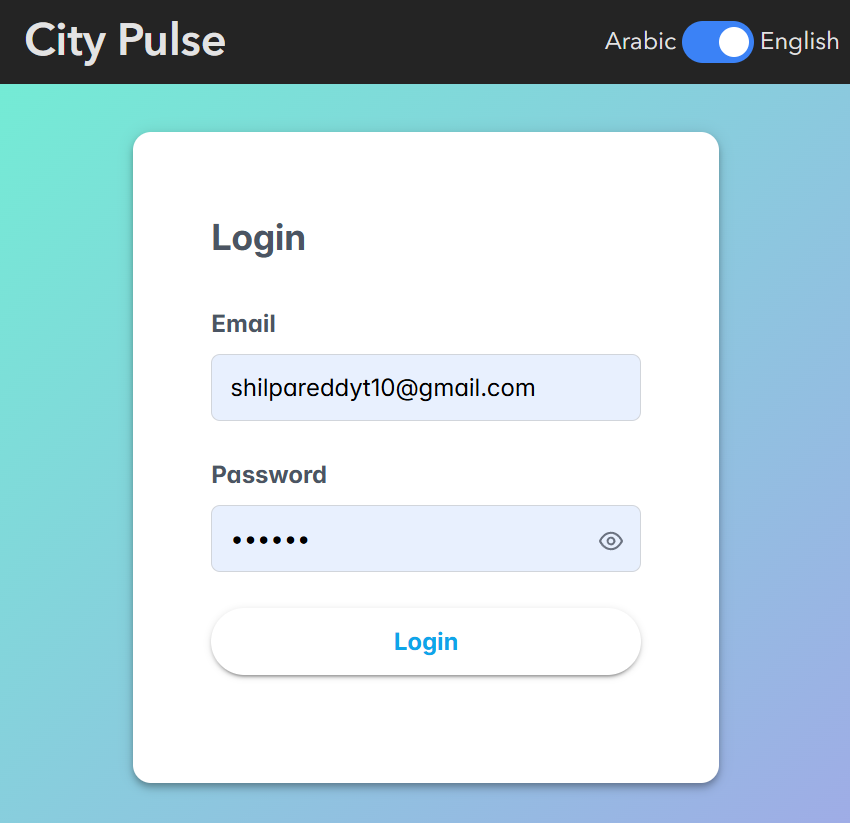
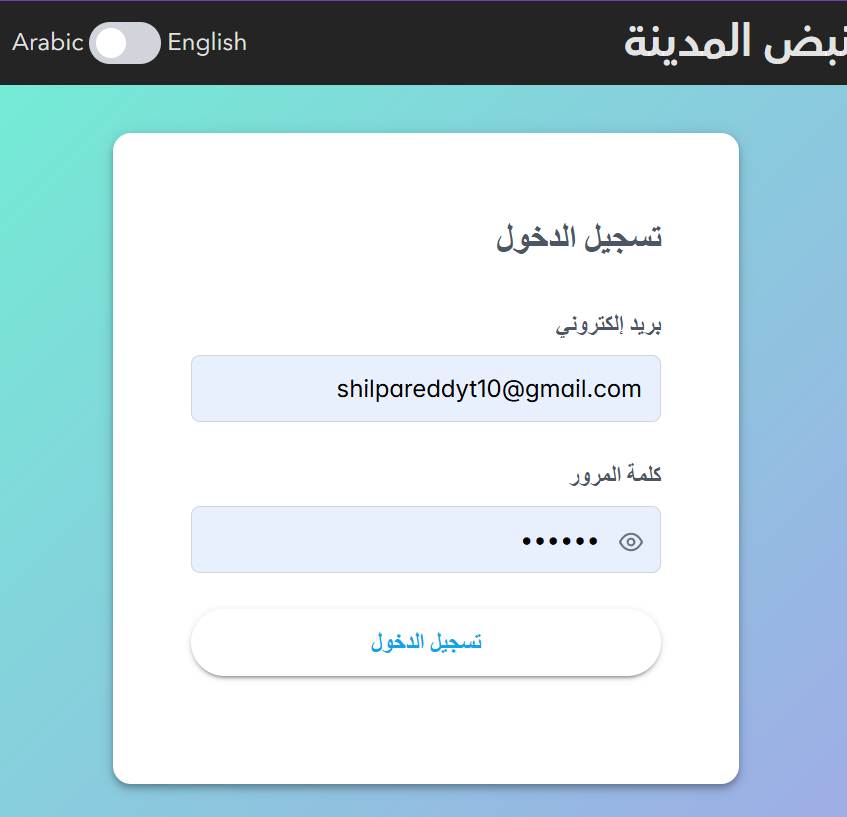
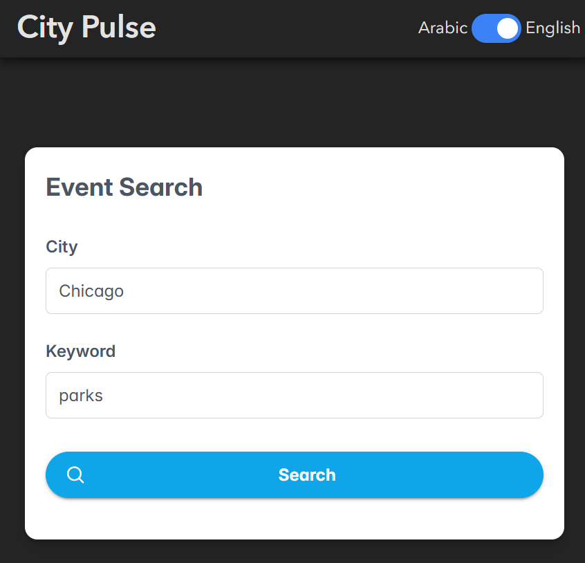
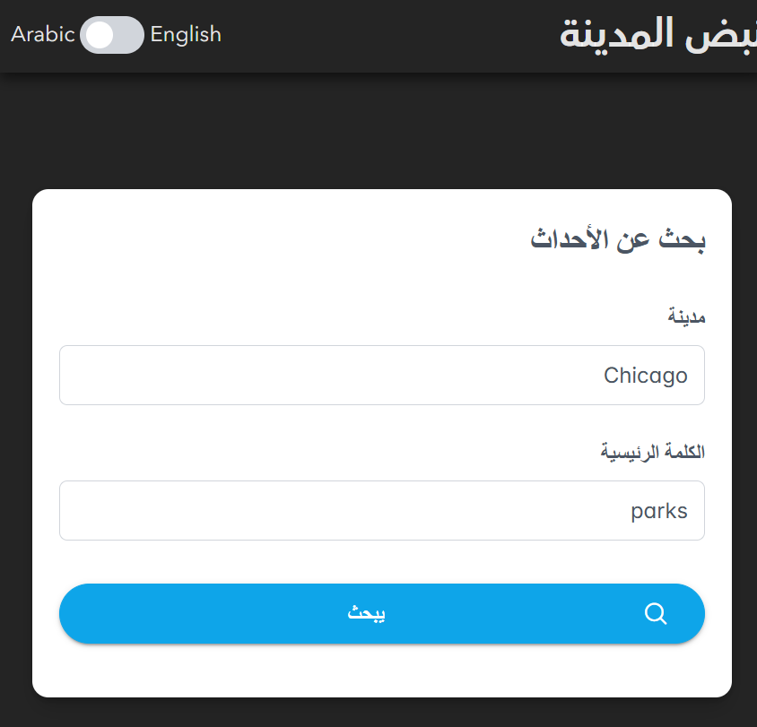
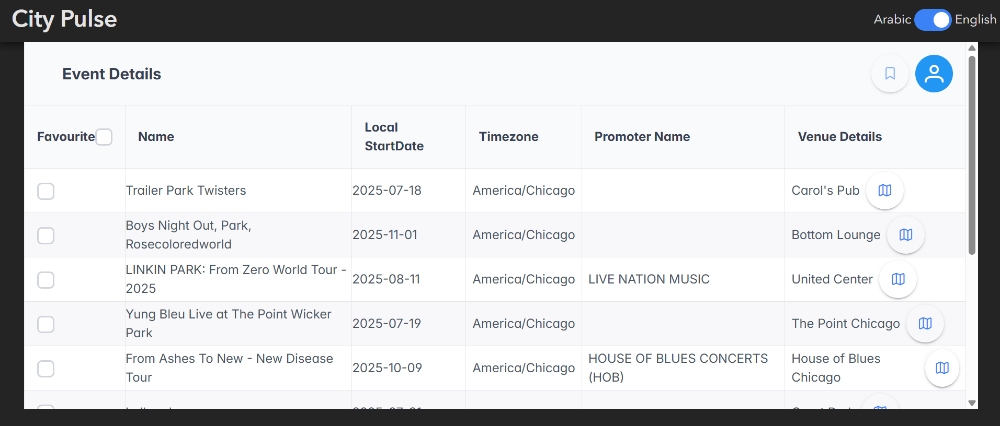
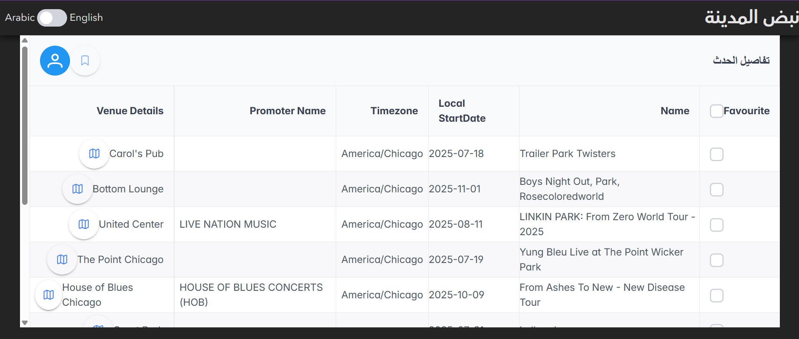
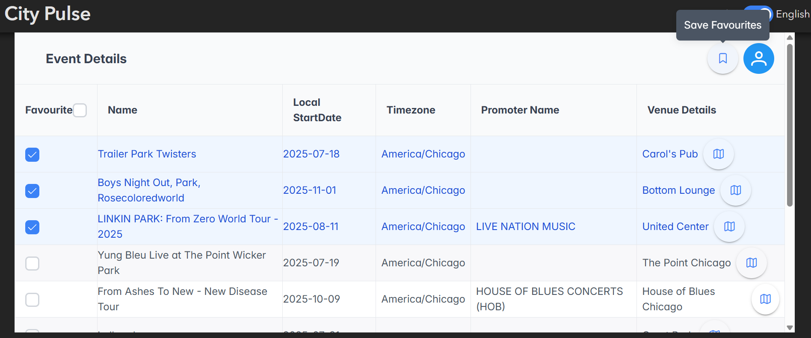
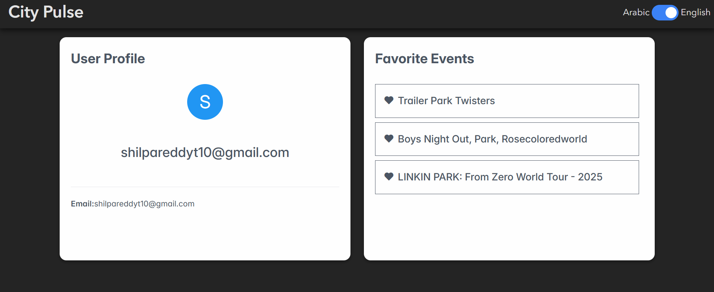
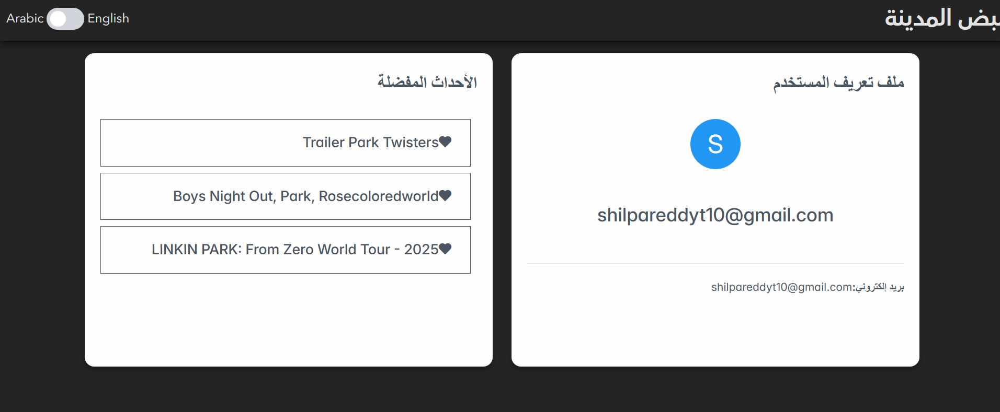

# city-pulse
City Pulse Local Events Explorer

1.Clone the project

2.npm install

3. Run the project using "npm run dev"

please use any gmail and password and click on the login, it will redirect you to home screen.
In home screen please give city and keyword 
Example : city : Chicago and keyword and park , it will take you to event details page where you can see details of each details , there is map symbol, when you click on it , dialog box will be opened with exact location on map.
In Event details table, please mark the favorite events and click on the Save Favorites button, it will save the events and show on the profile page. 

please find the screenshots below

login page in english

 

login page in arabic

 

home screen in english

 

home screen in arabic

 

Event details page in english

 

Event details page in arabic

 

Please click on the Save favorites, it saves and takes to Profile page

 

Profile page in english

 

 Profile page in arabic

